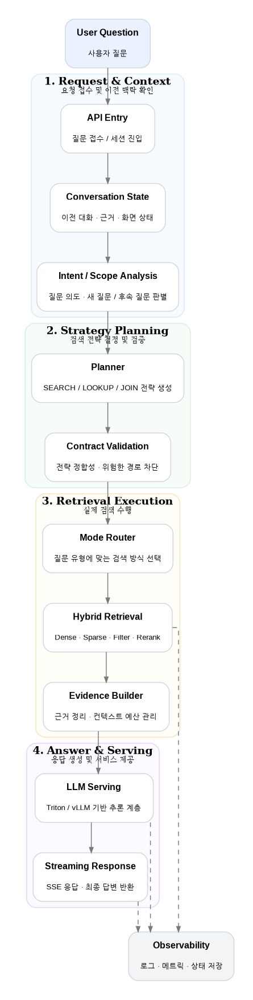

  <strong>English</strong> | <a href="README.md">한국어</a>

<h1 align="center">Seungju Lee | LLM Serving & RAG Systems Engineer</h1>

  FastAPI · Qdrant · Triton/vLLM · On-prem GPU · Hybrid Retrieval

  I build AI systems that are accurate, evidence-driven, and operable in production.

I started from backend engineering and now focus on **LLM serving, RAG retrieval, and production AI backend systems**.  
At MisoTech, I’ve worked on KISTI-led scholarly and national R&D platforms, covering everything from legacy modernization to **hybrid retrieval, GPU inference, streaming APIs, and production operations**.

[Blog / Notes](https://www.notion.so/JusengLee-1753a475fe0080a3b62eef1af1688e19?source=copy_link)

---

## What I Do

- I design, build, and operate **domain-specific RAG systems** and **LLM serving infrastructure**.
- I care about **retrieval quality, response latency, and operational reliability** together.
- My main interests are **LLM Serving, Hybrid Retrieval, AI Backend, Data Pipelines, and Observability**.

---

## Featured Projects

### 1) NTIS AI Chatbot — Search Engine-Grade RAG
A domain chatbot for national R&D information that evolved from a simple RAG prototype into a **search-engine-style retrieval system**.

**Why it was hard**
- The system had to support detail lookups, people / organization queries, list-style queries, and relational queries together.
- The NTIS domain has structural semantics such as ID / NO and multiple organization roles, which easily lead to noisy candidates if treated like plain text search.

**What I built**
- Explicit **SEARCH / LOOKUP / JOIN** mode separation
- **Planner–Contract–Executor** architecture
- Qdrant-based **hybrid retrieval + rerank**
- A production AI backend with FastAPI, Triton/vLLM, and Redis

**Public evidence**
- Average retrieval time: **0.4s**
- Average Triton response time: **4.4s**
- End-to-end pipeline time: **5.3s per query**
- Embedding comparison showed `multilingual-e5-large` outperforming `bge-m3` in throughput

[Read the full case study](./case-studies/ntis-rag-chatbot.md)

---

### 2) Everyone's R&D — Intent Analysis & Classification
An LLM system that transforms free-form user feedback into **corrected text, structured summaries, and topic classifications**.

**Why it mattered**
- The goal was not just natural-language output, but **structured outputs** that could be used directly in review workflows.
- The system had to run in an **on-prem inference environment**, not as a thin wrapper over external APIs.

**What I built**
- An LLM-based intent-analysis pipeline
- **Gemma 3 + Triton + multi-model orchestration**
- End-to-end API flow from request input to structured result
- Repeated prompt / pipeline / serving improvements for stable outputs

**Public evidence**
- A three-stage pipeline: refinement / structured summary / classification
- Topic taxonomy (T1–T5)
- An operational Triton serving guide for the on-prem environment

[Read the full case study](./case-studies/everyones-rnd-intent-classification.md)

---

## Selected Delivery

### Oracle → Embedding → Vector DB Pipeline
A production-oriented ingestion pipeline that converts Oracle-based source data into vector-search-ready assets.  
The key themes were **incremental ingestion, checkpointing, retry / recovery, and embedding model evaluation**.
[Read the full case study](./case-studies/oracle-to-qdrant-pipeline.md)

### Scholarly OA AI Summarization
An AI summarization feature built for a scholarly platform covering roughly **400,000 papers**.  
This work connected GPU inference, FastAPI integration, result persistence, request control, and platform integration into a real product feature.
[Read the full case study](./case-studies/accessON-ai-summarization.md)

---

## Public Repositories

- [llm_article_rag_test](https://github.com/jusenglee/llm_article_rag_test) — experiments on RAG structure, retrieval quality, and reranking
- [PDF_Extraction_Web](https://github.com/jusenglee/PDF_Extraction_Web) — PDF extraction and document-processing workflow experiments
- [oracle_to_qdrant__pipe](https://github.com/jusenglee/oracle_to_qdrant__pipe) — Oracle preprocessing, embedding, and vector DB ingestion

---

## Additional Technical Notes (Optional)

For readers who want deeper operational details:

- [LLM Serving & Infrastructure Optimization](./llm-serving-optimization.md)
- [Troubleshooting & Incident Response](./war-stories-runbook.md)

---

## Tech Stack

| Area | Stack |
| --- | --- |
| Languages | Python, Java |
| Backend / API | FastAPI, Spring Boot, REST API, SSE |
| LLM / Retrieval | Triton Inference Server, vLLM, Qdrant, LangGraph |
| Data / Infra | Oracle, Redis, Docker, Linux |
| Operations | Logging, Metrics, Quality Gates, Incident Response |

---

> Some service code and internal artifacts are not public due to company security policies.  
> This repository focuses on **architecture, decisions, public evidence, and technical contribution**.
