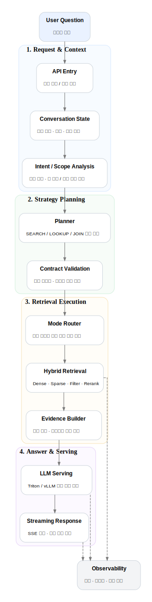
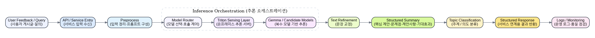

  <a href="README.en.md">English</a> | <strong>한국어</strong>

<h1 align="center">이승주 | LLM Serving & RAG Systems Engineer</h1>

  FastAPI · Qdrant · Triton/vLLM · On-prem GPU · Hybrid Retrieval

  정확하게 찾고, 근거를 남기고, 운영 가능한 AI 시스템을 만듭니다.

백엔드 개발에서 출발해 현재는 **LLM 서빙, RAG 검색, 운영형 AI 백엔드**를 중심으로 일하고 있습니다.  
KISTI 주관 학술·국가 R&D 데이터 플랫폼을 개발·운영하며, 레거시 웹 서비스 현대화부터 **하이브리드 검색, GPU 추론, 스트리밍 API, 운영 안정화**까지 실제 서비스 관점에서 문제를 해결해 왔습니다.

[Blog / Notes](https://www.notion.so/JusengLee-1753a475fe0080a3b62eef1af1688e19?source=copy_link)

---

## What I Do

- 도메인 특화 **RAG 검색 시스템**과 **LLM 서빙 인프라**를 설계·구현·운영합니다.
- **검색 품질 / 응답 지연 / 운영 안정성**을 함께 최적화하는 것을 중요하게 생각합니다.
- 관심 분야는 **LLM Serving, Hybrid Retrieval, AI Backend, Data Pipeline, Observability**입니다.

---

## Featured Projects

### 1) 국가 R&D AI 챗봇 — Search Engine-Grade RAG
국가 R&D 정보 도메인 챗봇을 단순 RAG가 아닌 **검색엔진형 구조**로 고도화한 프로젝트입니다.

**왜 어려웠나**
- 상세조회, 사람/기관 조회, 목록형, 관계형 질의를 한 시스템에서 모두 처리해야 했습니다.
- 국가 R&D 도메인은 ID / NO, 수행기관 / 참여기관 / 소속기관처럼 의미 구조가 복잡해 일반 검색 방식으로는 오염 후보가 쉽게 늘어납니다.

**내가 한 일**
- **SEARCH / LOOKUP / JOIN** 전략 분리
- **Planner–Contract–Executor** 구조 설계
- Qdrant 기반 **Hybrid Retrieval + Rerank** 고도화
- FastAPI, Triton/vLLM, Redis 기반 운영형 AI 백엔드 구성

**공개 가능한 근거**
- Qdrant 검색 평균 **0.4초**
- Triton 응답 평균 **4.4초**
- 전체 파이프라인 평균 **5.3초 / 질의**
- 임베딩 비교 기준: `multilingual-e5-large`가 `bge-m3` 대비 처리량 우세

[상세 케이스 스터디 보기](./case-studies/R&D-rag-chatbot.md)

---

### 2) 모두의 R&D 사업 질의의도 분석 및 분류 시스템
자유 형식 사용자 의견을 **교정 → 구조화 요약 → 주제 분류**로 변환하는 LLM 시스템입니다.

**왜 중요했나**
- 단순 자연어 응답이 아니라, 실제 검토와 분류에 바로 쓸 수 있는 **정형화된 결과**가 필요했습니다.
- 외부 API가 아니라 **온프레미스 추론 서버** 기반으로 운영 가능한 구조가 필요했습니다.

**내가 한 일**
- LLM 기반 질의의도 분석 파이프라인 설계
- **Gemma 3 + Triton + 복수 모델 오케스트레이션** 구조 설계
- 입력 → 추론 → 결과 반환의 E2E API 흐름 구성
- 프롬프트, 파이프라인, 서빙 구조를 반복 개선해 응답 일관성 강화

**공개 가능한 근거**
- 교정 / 구조화 요약 / 분류의 **3단계 출력 파이프라인** 구성
- T1~T5 토픽 체계 기반 분류 설계
- 온프레미스 Triton 기반 운영형 서빙 가이드 존재

[상세 케이스 스터디 보기](./case-studies/everyones-rnd-intent-classification.md)

---

## Selected Delivery

### Oracle → Embedding → Vector DB Pipeline
Oracle 기반 원천 데이터를 전처리 → 임베딩 → Vector DB 적재까지 연결하는 운영형 파이프라인을 설계·구현했습니다.  
핵심은 **증분 적재, 체크포인트, 실패 복구, 임베딩 모델 비교 평가**였습니다.
[상세 케이스 스터디 보기](./case-studies/oracle-to-qdrant-pipeline.md)

### Scholarly OA AI Summarization
약 **40만 건 규모 논문 데이터**를 대상으로 AI 초록 요약 기능을 설계·적용했습니다.  
GPU 추론 환경 구성, FastAPI 연동, 결과 저장, 요청 제어, 플랫폼 연계를 포함해 **실험이 아닌 서비스 기능**으로 연결했습니다.
[상세 케이스 스터디 보기](./case-studies/scholarly-ai-summarization.md)

---

## Public Repositories

- [llm_article_rag_test](https://github.com/jusenglee/llm_article_rag_test) — RAG 구조 실험, retrieval 품질 검토, rerank 아이디어 테스트
- [PDF_Extraction_Web](https://github.com/jusenglee/PDF_Extraction_Web) — PDF 추출 및 웹 기반 문서 처리 흐름 실험
- [oracle_to_qdrant__pipe](https://github.com/jusenglee/oracle_to_qdrant__pipe) — Oracle 전처리, 임베딩, Vector DB 적재 파이프라인 구현

---

## Additional Technical Notes (Optional)

깊게 보는 분을 위해 운영/최적화 관련 노트를 따로 정리했습니다.

- [LLM Serving & Infrastructure Optimization](./infrastructure/llm-serving-optimization.md)
- [Troubleshooting & Incident Response](./infrastructure/war-stories-runbook.md)

---

## Tech Stack

| Area | Stack |
| --- | --- |
| Languages | Python, Java |
| Backend / API | FastAPI, Spring Boot, REST API, SSE |
| LLM / Retrieval | Triton Inference Server, vLLM, Qdrant, LangGraph |
| Data / Infra | Oracle, Redis, Docker, Linux |
| Operations | Logging, Metrics, Quality Gates, Incident Response |

---

> 회사 보안 정책상 실제 서비스 코드와 일부 내부 산출물은 공개하지 않았습니다.  
> 대신 이 저장소에서는 **아키텍처, 설계 의사결정, 공개 가능한 근거, 기술적 기여**를 중심으로 정리합니다.
