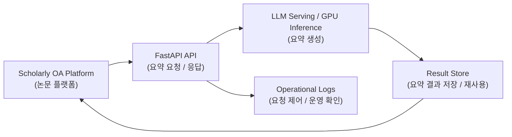

# Scholarly OA AI Summarization

> **Confidentiality Note**  
> 본 문서는 회사 보안 정책을 준수하는 범위에서, 공개 가능한 역할과 구현 범위만 정리한 포트폴리오용 케이스 스터디입니다.

---

## 1. Project Overview

이 프로젝트는 대형 논문 OA 플랫폼에 **AI 초록 요약 기능**을 도입한 작업입니다.  
대상 데이터는 약 **40만 건 규모의 논문 데이터**였고, 사용자는 플랫폼 안에서 논문 정보를 탐색할 때 요약 정보를 함께 확인할 수 있도록 설계했습니다.

핵심은 단순히 모델을 호출하는 것이 아니라,  
**GPU 추론 환경 구성 → LLM API 개발 → 플랫폼 연동 → 결과 저장 및 운영**까지  
서비스형 AI 기능으로 연결하는 것이었습니다.

---

## 2. Problem

### 2.1. 대규모 논문 데이터를 서비스 기능으로 연결해야 했습니다
논문 수가 많을수록 단순 원문/메타데이터만으로는 사용자 탐색 부담이 커집니다.  
따라서 요약 기능은 “있으면 좋은 옵션”이 아니라, 실제로 탐색 편의성을 높이는 서비스 기능이어야 했습니다.

### 2.2. 실험이 아니라 플랫폼 기능으로 동작해야 했습니다
필요한 것은 모델 데모가 아니라 아래를 포함한 제품 수준의 흐름이었습니다.

- GPU 기반 추론 환경
- FastAPI 기반 API
- 결과 저장
- 요청 제어
- 운영 로그
- 기존 플랫폼과의 연동

즉, 이 프로젝트는 요약 모델 하나를 붙이는 것이 아니라,  
**기존 서비스 안에 AI 기능을 제품 수준으로 편입하는 작업**이었습니다.

---

## 3. Key Design Decisions

## 3.1. Serving Layer를 플랫폼과 분리
기존 서비스 코드 안에 생성 로직을 직접 넣기보다,  
FastAPI 기반의 별도 API 레이어로 요약 기능을 구성해 연동성과 운영 편의성을 높였습니다.

## 3.2. 결과 저장과 요청 제어를 고려
요약은 요청마다 매번 새로 생성하는 것보다,  
필요 시 결과를 저장하고 재사용하는 흐름이 서비스 운영에 더 적합했습니다.  
또한 요청이 몰릴 수 있는 상황을 고려해 요청 제어와 운영 로그를 함께 설계했습니다.

## 3.3. End-to-End 흐름 중심으로 구현
GPU 환경 준비, 모델 연동, API, 플랫폼 연결, 결과 저장까지  
한 흐름으로 이어지도록 구현해 실제 사용자 기능으로 이어지게 했습니다.

---

## 4. Architecture

---

## 5. What I Built

- GPU 기반 추론 환경 구성
- FastAPI 기반 LLM API 개발
- 플랫폼 연동 인터페이스 구현
- 요약 결과 저장 및 재사용 흐름 설계
- 요청 제어와 운영 로그 처리
- 대규모 논문 데이터(약 40만 건) 대상 End-to-End 적용

---

## 6. Outcome

이 프로젝트를 통해 플랫폼 사용자는 대규모 논문 데이터에서  
요약 정보를 함께 확인할 수 있게 되었고, AI 기능은 실험이 아닌 **서비스 기능**으로 편입되었습니다.

정리하면, 이 프로젝트는 다음 경험을 남겼습니다.

- 대규모 콘텐츠 플랫폼에 AI 기능을 실제로 붙이는 경험
- GPU 추론 환경과 API 서버를 운영 관점에서 정리한 경험
- 기존 제품 안에 LLM 기능을 넣을 때 필요한 요청 제어 / 저장 / 연동 문제를 해결한 경험

---

## 7. Lessons Learned

1. **AI 기능은 모델 품질만큼 서비스 연동 방식이 중요하다.**
2. **결과 저장과 요청 제어가 없으면 운영형 기능으로 가기 어렵다.**
3. **End-to-End로 연결해야 제품 관점의 문제를 볼 수 있다.**

---

## 8. Tech Stack

- **Language**: Python
- **Backend / API**: FastAPI
- **Serving**: GPU-based inference environment
- **Platform Integration**: API integration, result persistence
- **Ops**: request control, logging, deployment support
