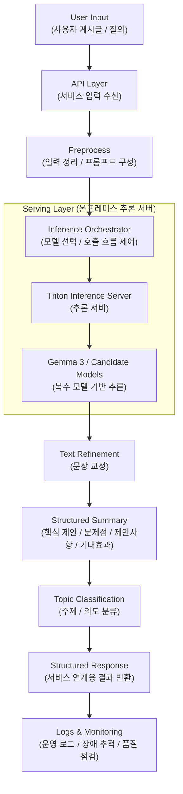

# 모두의 R&D 질의의도 분석 및 분류 시스템

> **Project Type**: LLM Serving / AI Backend / Intent Analysis  
> **Role**: LLM Server Engineer  
> **Disclosure**: 일부 비공개

## 1. Overview

과기부 산하 **「모두의 R&D」** 서비스의 사용자 게시글/질의를 대상으로, 원문을 단순 생성형 응답으로 처리하는 대신 **교정 → 구조화 요약 → 의도/주제 분류**로 이어지는 실무형 파이프라인을 설계·구현한 프로젝트입니다.

핵심 목표는 두 가지였습니다.

1. 자유 형식으로 들어오는 사용자 의견·문의 글을 **일관된 구조의 결과물**로 변환할 것  
2. 이를 실제 서비스에 연계 가능한 형태로 만들기 위해, **온프레미스 추론 서버와 API 흐름을 안정적으로 운영**할 것

저는 이 프로젝트에서 **LLM 기반 질의의도 분석 파이프라인 설계**, **Triton 기반 추론 서버 서빙 구조 구현**, **서비스 연계용 API 흐름 구성**, **운영 안정화**를 맡았습니다.

---

## 2. Problem

이 프로젝트의 본질은 “LLM을 붙여서 요약을 만든다”가 아니었습니다. 실제로는 다음과 같은 운영형 요구가 동시에 있었습니다.

- 사용자 입력이 짧은 요청문부터 긴 제안서형 글까지 다양해, **입력 품질이 고르지 않음**
- 결과물이 단순 자연어 응답이 아니라, 실무에서 바로 쓸 수 있는 **정형화된 결과 형식**이어야 함
- 서비스 운영 환경이 온프레미스이기 때문에, 외부 API 의존이 아닌 **자체 서빙 구조**가 필요함
- 모델 출력 품질뿐 아니라 **응답 일관성**, **운영 편의성**, **배포/재시작/로그 추적성**까지 같이 확보해야 함

즉, 이 프로젝트는 모델 성능만 보는 PoC가 아니라, **실제 서비스에 연결되는 AI 기능을 제품화하는 문제**에 가까웠습니다.

---

## 3. What the System Produced

이 시스템은 사용자 게시글을 입력받아 다음과 같은 **3단계 결과물**을 생성하도록 설계했습니다.

### 3.1 Text Refinement
- 원문의 문맥은 유지하면서
- 맞춤법과 표현을 교정하고
- 요청된 말투에 맞게 문장을 다듬음

### 3.2 Structured Summary
출력을 단순 요약문이 아니라 아래와 같은 고정 구조로 만들었습니다.

- 핵심 제안
- 문제점
- 제안사항
- 기대효과

이 구조 덕분에 사람이 일일이 문서를 다시 읽지 않아도, 다수의 의견을 빠르게 검토하고 비교할 수 있게 했습니다.

### 3.3 Topic / Intent Classification
교정·요약 결과를 바탕으로 의견을 주제별로 분류할 수 있도록 설계했습니다. 확장 테스트 시트에서는 아래와 같은 토픽 체계를 사용했습니다.

- **T1** 연구비·정산 제도 개선
- **T2** 평가·선정·성과제도 개선
- **T3** 정보 접근·알림 시스템
- **T4** 창업기업·특수기관 지원
- **T5** 인력 기준 및 연구자 자율성

즉, 이 시스템은 단순한 “챗봇 답변”이 아니라, **비정형 사용자 의견을 교정·요약·분류 가능한 구조 데이터로 전환하는 파이프라인**에 가까웠습니다.

---

## 4. Key Design Decisions

## 4.1 모델 출력보다 파이프라인 일관성을 우선
초기에는 모델이 한 번에 모든 것을 잘 해주길 기대할 수 있지만, 실제 운영에서는 **출력 형식의 안정성**이 훨씬 중요했습니다.  
그래서 결과를 자유 텍스트가 아니라 **교정 / 구조화 요약 / 분류** 단계로 나누고, 각 단계의 역할을 명확히 나누는 쪽으로 설계했습니다.

## 4.2 복수 모델 기반 추론 오케스트레이션
테스트환경에서는 온프레미스 **H100 2GPU 환경**에서 **Gemma 3를 포함한 복수 모델 기반 추론 오케스트레이션**을 설계했습니다.  
모델 하나에만 묶이지 않도록 하고, 향후 품질 비교·교체·확장 가능성을 고려해 서빙 구조를 분리했습니다.

## 4.3 Triton 중심의 운영형 서빙 구조
모델 서빙은 Triton Inference Server를 중심으로 구성했습니다.  
관련 테스트 운영 문서에는 Gemma3 GGUF 모델을 Triton Python backend에서 서빙하기 위한 model repository 구조, `config.pbtxt`, `model.py`, dynamic batching, Docker/Jupyter 기반 운영 흐름, logs/metrics 관리 방식이 정리되어 있습니다. 이 구조는 단순 실험용이 아니라 **재시작·업데이트·로그 추적이 가능한 운영형 구조**를 지향했습니다.

## 4.4 서비스 연계를 위한 E2E API 흐름
질의 입력부터 분석 결과 반환까지를 서비스와 바로 연결할 수 있도록, 입력 → 추론 → 결과 반환 흐름을 API로 묶었습니다.  
이 과정에서 단순 모델 호출보다 **응답 포맷 일관성**과 **운영 측면의 장애 추적성**을 우선했습니다.

---

## 5. Architecture

이 구조의 핵심은 **모델 한 번 호출해서 답변을 뽑는 구조가 아니라**, 결과를 실제 서비스 기능으로 연결할 수 있도록 **정형화된 출력 파이프라인**으로 만든 점입니다.

---

## 6. What I Built

### 6.1 LLM 기반 질의의도 분석 파이프라인 설계·구현
- 자유 형식 게시글을 바로 응답하는 대신
- 교정 → 요약 → 분류 단계로 나눈 결과 생성 구조 설계
- 실무 검토에 바로 사용할 수 있도록 출력 포맷을 고정

### 6.2 Triton 기반 서빙 환경 구축
- Triton Inference Server 기반 추론 서버 구성
- Gemma3 GGUF 모델 서빙 구조 정리
- Docker 기반 실행 환경, model repository, logs, restart workflow 정비
- 모델 업데이트 및 운영 테스트가 가능한 구조로 서버 정리

### 6.3 복수 모델 기반 추론 오케스트레이션
- Gemma 3 포함 복수 모델을 비교·실험 가능한 흐름으로 설계
- 향후 품질 비교 및 교체를 고려한 구조화
- 모델 단일 종속보다 운영 유연성을 확보하는 방향으로 설계

### 6.4 서비스 연계 및 운영 개선
- 입력부터 결과 반환까지 E2E API 흐름 구성
- 운영 안정성을 위해 서버 구조 및 실행 흐름 정비
- 프롬프트 / 파이프라인 / 서빙 구조를 반복 개선하여 응답 일관성 강화

---

## 7. Evidence

공개 가능한 범위에서 확인할 수 있는 근거는 아래와 같습니다.

### 7.1 확장 테스트 시트 기반 결과 생성
업로드된 테스트 시트에서는 **IRIS 개선의견 데이터 36건**에 대해 Gemma3 12B GGUF 기반 결과가 채워져 있으며, 각 입력에 대해 아래 항목이 생성되도록 구성되어 있습니다.

- 교정 결과
- 구조화 요약 결과
- 분류 결과

이는 단순 샘플 1~2건이 아니라, **다건 의견 데이터를 대상으로 일관된 출력 구조를 적용하려는 파이프라인 설계**였음을 보여줍니다.

### 7.2 구조화된 분류 체계
같은 테스트 자료에는 T1~T5의 토픽 체계가 정의되어 있어, 생성 결과가 단순 요약문이 아니라 **후속 검토·집계·정책 분류에 연결될 수 있는 형태**로 설계되었음을 확인할 수 있습니다.

### 7.3 운영형 Triton 서빙 가이드
업로드된 Triton 운영 자료에는 다음과 같은 운영 요소가 포함되어 있습니다.

- Gemma3 GGUF 기반 model repository 구조
- `config.pbtxt` 기반 입출력/배치/컨텍스트 설정
- Docker 컨테이너 운영 방식
- Jupyter 기반 개발·테스트 워크플로우
- logs / metrics / restart workflow

즉, 이 프로젝트는 단순 모델 호출 예제가 아니라 **운영 가능한 추론 서버 구조**를 갖추는 데 초점을 두었습니다.

> 정확도, latency, throughput 같은 정량 수치는 현재 공개 가능한 자료만으로는 일관되게 제시하기 어려워 본 문서에서는 포함하지 않았습니다.

---

## 8. Impact

이 프로젝트를 통해 얻은 실질적 결과는 다음과 같습니다.

- 사용자 게시글을 **실무형 구조 데이터**로 변환하는 파이프라인 구축
- LLM 기능을 서비스에 연결 가능한 **E2E API 흐름**으로 정리
- 온프레미스 환경에서 운영 가능한 **Triton 기반 서빙 구조** 구축
- 프롬프트 / 파이프라인 / 서빙 구조를 함께 조정하며 **응답 일관성**과 **운영 안정성** 강화

즉, 단순히 “LLM을 붙여봤다”가 아니라, **비정형 의견 데이터를 실제 업무 흐름에서 활용 가능한 형태로 바꾸는 AI 기능을 제품 수준으로 정리한 경험**이었습니다.

---

## 9. Lessons Learned

이 프로젝트를 통해 가장 크게 배운 점은, 서비스형 LLM 시스템에서 중요한 것은 모델 하나의 성능만이 아니라는 점이었습니다.

- 모델 출력이 좋아 보여도 **형식이 흔들리면 운영에서 쓰기 어렵다**
- 추론 서버는 호출만 되는 것이 아니라 **재시작·업데이트·로그 추적이 가능해야 한다**
- 서비스에 연결하려면 결국 **출력 구조, API 흐름, 운영 안정성**이 함께 설계되어야 한다

그래서 이 프로젝트는 제게 “LLM을 잘 호출하는 방법”보다, **LLM 기능을 실제 서비스 기능으로 정리하는 방법**을 배운 프로젝트로 남아 있습니다.

---

## 10. Tech Stack

- **Language**: Python
- **Backend / API**: FastAPI, REST API
- **Serving**: Triton Inference Server, Triton Python Backend
- **Model / Runtime**: Gemma 3, GGUF, llama.cpp 기반 서빙 구조
- **Infra**: Docker, Linux, On-prem GPU environment
- **Ops**: Logs, Metrics, Restart workflow, Jupyter-based development

---

## 11. Portfolio Note

회사 보안 정책상 실제 서비스 코드와 내부 운영 상세는 공개하지 않았습니다.  
대신 이 문서에서는 **문제 정의 → 설계 결정 → 서빙 구조 → 서비스 연계 → 운영 개선**의 흐름을 중심으로, 공개 가능한 자료 범위 안에서 프로젝트의 핵심 기술 기여를 정리했습니다.
