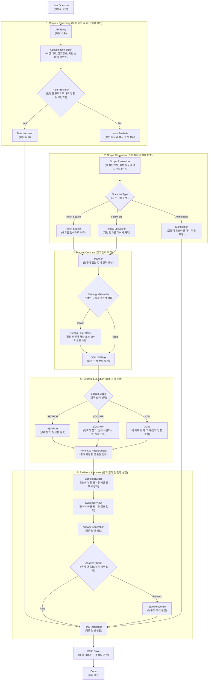

# NTIS AI 챗봇 사업
## NTIS Domain RAG Chatbot — Search Engine-Grade Retrieval Case Study

> **비공개 회사 프로젝트 기반 케이스 스터디**  
> 본 문서는 공개 가능한 범위에서 **검색 전략, 아키텍처, 설계 의사결정, 운영 관점의 교훈**을 정리한 포트폴리오 문서입니다.  
> 일부 내부 구현 상세, 실제 서비스 데이터, 운영 지표의 세부값은 보안상 제외했습니다.

---

## 1. 프로젝트 개요

NTIS AI 챗봇은 국가 R&D 정보 도메인에 특화된 질의응답 시스템입니다.  
초기에는 일반적인 RAG(Retrieval-Augmented Generation) 방식으로 시작했지만, 요구사항이 구체화되면서 단순히 “관련 문서를 몇 개 찾아 답변하는 챗봇” 수준으로는 부족해졌습니다.

실제 사용자 질문은 다음처럼 매우 다양했습니다.

- 특정 과제나 성과를 **정확히 찾아야 하는 조회형 질문**
- 사람·기관·연도·성과유형을 조건으로 묻는 **필터형 질문**
- 과제와 성과 간 연결관계를 묻는 **관계형 질문**
- 짧고 애매하지만 의미축은 많은 **탐색형 질문**

이 프로젝트의 핵심은, 이러한 요구를 만족시키기 위해 NTIS 챗봇을 **검색엔진형 구조로 고도화**한 것이었습니다.

---

## 2. 왜 어려웠는가

가장 어려웠던 지점은 **검색 정확도**와 **다양한 질의 처리성**을 동시에 만족시키는 것이었습니다.

초기 RAG에서는 “대충 관련 문서를 찾아 답변 생성”하는 수준으로도 동작은 가능했습니다. 하지만 실제 서비스 요구사항은 훨씬 더 엄격했습니다.

- 정확조회에서는 틀리면 안 됨
- 탐색형 질의에서는 누락이 적어야 함
- 관계형 질의에서는 결과의 설명 가능성과 재현성이 필요함
- 운영 단계에서는 “왜 이 결과가 나왔는지”를 추적할 수 있어야 함

특히 NTIS 도메인은 데이터 구조 자체가 복잡했습니다.

- 과제는 **ID(단일 시행 인스턴스)** 와 **NO(동일 과제 그룹)** 가 서로 다른 의미를 가짐
- “기관”이라는 자연어 표현이 실제 데이터에서는 **수행기관 / 참여기관 / 참여인력 소속기관**으로 나뉨
- 사람·기관 정보가 nested 구조로 저장되어 있어 단순 키워드 검색만 쓰면 **오염 후보(contamination)** 가 쉽게 유입됨

즉, 이 문제는 단순한 검색 성능 튜닝이 아니라, **도메인 의미를 검색 구조에 맞게 해석하고 고정하는 문제**에 가까웠습니다.

---

## 3. 문제를 어떻게 풀었는가

### 3.1 SEARCH / LOOKUP / JOIN 전략 분리

가장 먼저 한 일은 질의를 하나의 검색 방식으로 처리하지 않고, **질문 유형에 따라 검색 모드를 명시적으로 분리**한 것입니다.

- **SEARCH**: 넓게 찾는 탐색형 검색  
  - 누락 방지를 우선함
  - 후보를 넓게 수집하고 후단 리랭킹으로 정리
  - server-side must 필터를 과도하게 넣지 않음

- **LOOKUP**: 정확히 찾는 조회형 검색  
  - 상세조회, 식별자 기반 질의, 사람/기관 질의에 적합
  - server-side must 필터와 structured gate를 적극 사용
  - broad search로 우회하지 않음

- **JOIN**: 관계를 찾는 2-hop 검색  
  - 과제 ↔ 성과 같은 관계형 질의 처리
  - Hop1에서 조인 키를 확보하고, Hop2에서 강제 필터로 이어감
  - 결과가 비어도 일반 SEARCH로 임의 강등하지 않음

이렇게 분리한 이유는 단순했습니다.  
탐색형 질의와 정확조회형 질의, 관계형 질의는 **좋은 결과의 기준 자체가 다르기 때문**입니다.

---

### 3.2 질의분석 파이프라인의 진화

이 프로젝트에서 가장 기억에 남는 전환점은 **질의분석 파이프라인 재설계**였습니다.

처음에는 정규식 기반으로 질의를 분류했습니다.  
하지만 엣지 케이스에서 치명적인 오류가 발생했습니다. 형태는 단순했지만, 실제 의미는 정확조회여야 하는 질문이 탐색형으로 잘못 흘러가거나, 사람/기관 기반 질의가 일반 키워드 검색으로 처리되며 오염 후보가 상위로 들어오는 문제가 반복되었습니다.

이를 해결하기 위해 한때 **LLM 플래너 기반의 유사 MCP 구조**로 전환했습니다.  
하지만 플래너와 답변 생성을 한 흐름에 섞어 놓자, 전략 결정과 최종 응답 생성이 서로 영향을 주며 **응답이 꼬이거나 해석이 흔들리는 문제**가 생겼습니다.

결국 최종 구조는 다음과 같이 정리했습니다.

- **Planner (질의분석/전략 결정)**
- **Retriever (검색 실행)**
- **Generator (답변 생성)**

즉, 질의분석과 답변생성을 분리하고 **체이닝 구조**로 연결했습니다.  
이렇게 하자 질의 해석의 결정성과 최종 응답 품질을 동시에 안정화할 수 있었습니다.

---

### 3.3 Planner–Contract–Executor 구조

구조적으로 가장 중요하게 본 원칙은 **“전략의 출처를 하나로 고정하는 것”** 이었습니다.

이를 위해 플래너는 질의마다 단 하나의 **Strategy(JSON 계약)** 을 출력하도록 만들고, 실행 레이어는 이를 재해석하거나 다시 결정하지 않도록 제한했습니다.

실행 레이어에서 허용한 것은 아래뿐입니다.

- filters → 검색 엔진 필터로 컴파일
- dense / sparse / hybrid 후보 수집
- rerank 수행
- context 구성

이 구조의 장점은 분명했습니다.

- 왜 이 질의가 SEARCH / LOOKUP / JOIN으로 갔는지 추적 가능
- 전략이 잘못되었는지, 실행이 잘못되었는지 원인 분리가 가능
- 운영 중 회귀(regression)와 디버깅 비용 감소

결국 이 프로젝트에서 중요했던 것은 “답이 잘 나오게 만드는 것”만이 아니라,  
**왜 그런 결과가 나왔는지 설명 가능한 시스템을 만드는 것**이었습니다.

---

### 3.4 도메인 의미를 구조에 녹인 Query Normalization

질의분석 단계에서는 people/org를 단순 토큰이 아니라 **1급 엔티티**로 승격했습니다.

또한 다음과 같은 정규화를 도입했습니다.

- `ids_map` 과 `ids_flat` 분리
- 기관 조건을 **수행기관 / 참여기관 / 소속기관**으로 분리
- 연도, 태그, 엔티티 역할을 명시적으로 정리
- Follow-up, refinement, reference anchor를 맥락 기반으로 처리

이 설계 덕분에 질의 의도와 실제 데이터 필드가 더 정합적으로 연결되었고, 사람/기관 질의에서 발생하던 검색 오염을 크게 줄일 수 있었습니다.

---

### 3.5 말기 고도화: 계약 위반을 로그가 아니라 제어로

후반부에는 단순히 전략을 정하는 것을 넘어, **전략 위반 자체를 제어**하는 방향으로 구조를 강화했습니다.

예를 들어,

- action–mode 불일치 검증
- JOIN relation 누락 검증
- PJT_ID / PJT_NO 혼합 입력을 계약 위반으로 처리
- 사람/기관 기반 관계 요청에서 불필요한 JOIN 제한
- 결과 계약(result contract)으로 저품질 상태 식별
- SEARCH 결과에서 식별자를 추출하면 LOOKUP / JOIN으로 승격하는 **promotion** 도입
- token budget 기반 context builder로 응답 시간과 컨텍스트 길이 제어

즉, 후보를 많이 가져오는 것이 목표가 아니라,  
**정책에 맞는 검색과 예산 안에서의 답변 품질을 함께 보장하는 것**이 목표였습니다.

---

## 4. 아키텍처

아래 다이어그램은 현재 포트폴리오용으로 정리한 NTIS 챗봇 구조입니다.  
영어 용어는 유지하되, 한국어 설명을 함께 넣어 비개발자도 흐름을 이해할 수 있도록 구성했습니다.

이 구조의 핵심은 질문을 바로 생성형 모델에 던지는 것이 아니라,  
**맥락 해석 → 전략 확정 → 검색 실행 → 근거 구성 → 답변 생성**의 책임을 분리해 검색 정확도와 운영 안정성을 함께 확보한 데 있습니다.

---

## 5. 내가 맡은 역할

이 프로젝트에서 저는 검색 파이프라인 전반을 주도했습니다.

### 설계
- NTIS 도메인 질의 유형 분석
- SEARCH / LOOKUP / JOIN 전략 정의
- Planner–Contract–Executor 구조 설계
- people/org 중심 Query Normalization 설계
- 결과 계약, promotion, token budget 설계

### 구현
- Qdrant 기반 hybrid retrieval 파이프라인 고도화
- filter policy, rerank, context builder 구현
- FastAPI 기반 AI 백엔드 연계
- Triton / vLLM 기반 LLM 서빙 구조 연결
- follow-up / refinement / clarification 흐름 설계

### 운영 관점 개선
- 전략 위반 검증과 fail-close 정책 도입
- 응답 생성 전후 품질 점검 계층 분리
- 검색 오염을 줄이기 위한 structured lookup 강화
- 디버깅 가능한 로그/상태 기반 흐름 정리

---

## 6. 공개 가능한 근거 (Evidence)

### 6.1 Qdrant + Triton 통합 시험

공개 논문 풀텍스트 약 90만 건(s2orc 기반)을 사용한 시험 환경에서, Qdrant 기반 검색과 Triton LLM을 결합한 질의응답 시스템의 동작을 검증했습니다.

확인된 공개 가능 지표는 다음과 같습니다.

- **Qdrant 검색 평균 응답 속도:** 약 0.4초
- **Triton 모델 응답 속도:** 평균 4.4초 내외
- **전체 파이프라인 평균 처리시간:** 약 5.3초 / 질의
- **RapidFuzz 키워드 매칭 정확도:** 85% 이상
- **키워드 확장 / 재랭킹 / 중복 제거 / 토큰 클램핑:** 정상 동작 확인

또한 문서에서는 다음 개선 과제를 제안했습니다.

- 스트리밍 토큰 응답 활성화
- 한국어 중심 RAG 게이트 강화
- 임베딩 캐싱 도입
- 검색 결과 하이라이트 기능 추가

> 참고: 위 수치는 NTIS 운영 환경 자체가 아니라 **통합 검증용 시험 환경 기준**입니다.

### 6.2 임베딩 모델 비교 실험

NTIS 서비스 개선을 위한 임베딩 모델 비교 실험에서는 `multilingual-e5-large` 와 `bge-m3`를 동일 환경에서 비교했습니다.

공개 가능한 결과는 다음과 같습니다.

- **처리 문서 수:** 100,000건
- **전체 소요 시간:** e5-large 약 24.4분 / bge-m3 약 28.9분
- **처리량:** e5-large 76.8 docs/s / bge-m3 63.0 docs/s
- **결론:** 속도, 안정성, 다국어 커버리지를 고려할 때 e5-large가 운영 기본 모델로 더 적합

이 실험은 임베딩 모델 선택을 감이 아니라 **측정과 비교를 바탕으로 결정했다는 근거**가 되었습니다.

---

## 7. 이 프로젝트를 통해 배운 점

이 프로젝트를 통해 가장 크게 배운 것은, 운영형 RAG에서 중요한 것은 “답이 잘 나오게 하는 것”만이 아니라는 점입니다.

정말 중요한 것은 아래 두 가지였습니다.

1. **질의가 왜 이런 검색 전략으로 처리되었는지 설명 가능해야 한다**
2. **탐색형 / 조회형 / 관계형 질의의 기준을 하나의 검색 방식으로 억지 통합하면 안 된다**

즉, 좋은 RAG는 단순히 생성 모델 성능에 기대는 구조가 아니라,  
**질의분석, 검색전략, 실행정책, 근거구성, 품질검증이 분리된 시스템**에 가깝다는 것을 배웠습니다.

그래서 이 프로젝트는 제게 단순한 챗봇 개발 경험이 아니라,  
**RAG를 검색엔진 수준의 구조로 바꿔본 경험**으로 남아 있습니다.

---

## 8. 기술 스택

- **Backend / API**: FastAPI, REST API, SSE
- **LLM Serving**: Triton Inference Server, vLLM
- **Retrieval / RAG**: Qdrant, Hybrid Retrieval, Rerank
- **Pipeline / State**: LangGraph, Redis
- **Infra / Ops**: Docker, Linux, Observability
- **Data**: Oracle, Vector DB Pipeline

---

## 9. 한 줄 요약

NTIS AI 챗봇은 단순한 문서 기반 RAG가 아니라,  
**정확도와 질의 처리성을 함께 만족시키기 위해 SEARCH / LOOKUP / JOIN 전략, 계약 기반 플래너, 하이브리드 검색, 품질 게이트를 갖춘 검색엔진형 RAG 시스템**으로 고도화한 프로젝트였습니다.
