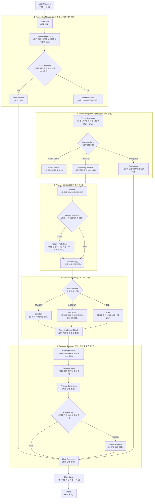

# NTIS AI Chatbot — Search Engine-Grade RAG for National R&D Information

> **Confidentiality Note**  
> 본 문서는 회사 보안 정책을 준수하는 범위에서, 공개 가능한 설계 의사결정·운영 관점·시험 결과만 정리한 포트폴리오용 케이스 스터디입니다.  
> 상세 소스코드, 내부 데이터 스키마 전체, 운영 환경의 민감정보는 제외했습니다.

---

## 1. Project Overview

NTIS AI 챗봇 사업은 국가 R&D 정보 도메인에 특화된 질의응답 시스템을 구축하는 프로젝트였습니다.  
초기에는 일반적인 RAG(Retrieval-Augmented Generation) 구조처럼 “관련 문서를 검색해 답변을 생성하는 챗봇”에 가까웠지만, 요구사항이 점점 구체화되면서 시스템의 성격이 달라졌습니다.

실제 서비스에서는 단순한 설명형 질문뿐 아니라,
- 과제 상세 조회,
- 사람/기관 기반 조회,
- 목록형·통계형 질의,
- 과제와 성과를 연결하는 관계형 질의
까지 함께 처리해야 했습니다.

이 때문에 프로젝트의 핵심은 단순한 챗봇 구현이 아니라, **검색 정확도와 다양한 질의 처리성을 함께 만족하는 “검색엔진형 RAG 구조”를 설계하는 것**으로 바뀌었습니다.

---

## 2. Why It Was Hard

### 2.1. NTIS 도메인은 일반 문서 검색보다 구조가 훨씬 복잡했습니다

NTIS 도메인에서는 같은 “과제”라도 단일 시행 인스턴스를 가리키는 **ID**와, 연도별 시행 이력을 묶는 **NO**의 의미가 다릅니다.  
또한 “기관”이라는 표현도 실제 데이터에서는 다음처럼 서로 다른 의미로 나뉩니다.

- 수행기관
- 참여기관
- 참여인력 소속기관

이 차이를 무시하고 단순 텍스트 검색으로 처리하면, 질문 의도와 무관한 후보가 대량으로 섞이는 **검색 오염**이 쉽게 발생합니다.

### 2.2. RAG에서 검색엔진으로 요구사항이 바뀌었습니다

초기 RAG 프로토타입 단계에서는 “관련 문서를 몇 개 찾아 답변을 생성하는 것”만으로도 의미가 있었습니다.  
하지만 서비스 요구사항이 고도화되면서 아래 두 가지를 동시에 만족시켜야 했습니다.

- **높은 검색 정확도**: 상세조회·식별자성 질의에서 틀리면 신뢰가 바로 무너짐
- **다양한 질의 처리성**: 짧고 모호한 질문, 목록형·관계형 질의까지 일관되게 처리해야 함

이 균형을 잡는 것이 이 프로젝트에서 가장 어려운 과제였습니다.

---

## 3. Key Design Decisions

## 3.1. SEARCH / LOOKUP / JOIN 전략 분리

이 프로젝트에서 가장 큰 설계 전환은 질의를 하나의 retrieval 규칙으로 처리하지 않고, **SEARCH / LOOKUP / JOIN** 세 가지 모드로 분리한 것입니다.

- **SEARCH**: 탐색형 검색
  - 누락 방지가 우선
  - 후보를 넓게 수집하고, 이후 재정렬로 정제
- **LOOKUP**: 정확조회
  - 식별자, 사람/기관, 상세 조회처럼 정확성과 재현성이 우선
  - server-side 필터를 적극 활용
- **JOIN**: 관계형 조회
  - 예: 과제 ↔ 성과
  - 2-hop 방식으로 조인 키를 확보한 뒤 후속 검색 수행

이렇게 나눈 이유는, 탐색형 질의와 정확조회 질의를 같은 방식으로 처리하면 둘 다 품질이 무너질 가능성이 높았기 때문입니다.

## 3.2. Planner–Contract–Executor 구조 도입

질의가 복잡해질수록 중요한 것은 “결과가 맞는가”뿐 아니라 **왜 그런 결과가 나왔는지 설명 가능한가**였습니다.

이를 위해 다음 구조를 도입했습니다.

- **Planner**: 질의를 해석하고 하나의 전략(Strategy)을 결정
- **Contract**: 전략이 유효한지 검증
- **Executor**: 전략을 그대로 실행

핵심 원칙은 다음과 같습니다.

- 플래너는 질의마다 **단 하나의 Strategy(JSON)** 를 만든다.
- 실행 레이어는 그 전략을 **재해석하거나 재결정하지 않는다.**
- 실행 레이어는 필터 컴파일, 후보 수집, 재정렬만 담당한다.

이 구조 덕분에 “플래너의 판단 문제인지, 실행 레이어 문제인지”를 구분할 수 있게 되었고, 운영 디버깅 가능성이 크게 좋아졌습니다.

## 3.3. Query Analysis 파이프라인 재설계

질의분석 방식도 여러 번 바뀌었습니다.

### 초기
- 정규식 기반 질의분석
- 구현은 빠르지만, 엣지 케이스에서 치명적인 오판이 발생

### 중간
- LLM 플래너 기반(MCP 유사) 구조 시도
- 질의분석 유연성은 올라갔지만, 플래너와 답변 생성을 한 흐름에 섞으면서 출력이 꼬이는 문제가 발생

### 최종
- **질의분석(Planner) → 검색 실행(Retrieval) → 답변 생성(Generator)** 분리
- 체이닝 구조로 연결해 분석 결과의 결정성과 응답 품질을 동시에 확보

이 전환은 프로젝트 전체에서 가장 기억에 남는 기술적 의사결정 중 하나였습니다.

## 3.4. People / Org 질의는 1급 엔티티로 승격

사람명과 기관명을 일반 검색어처럼 취급하면 문서 어디엔가 동일 토큰이 있다는 이유만으로 후보가 과도하게 유입될 수 있습니다.  
그래서 사람/기관 기반 질의는 별도 엔티티로 취급하고, 기본적으로 LOOKUP 모드에 가깝게 다루도록 설계했습니다.

또한 기관 조건은 다음처럼 의미를 분리해 다뤘습니다.

- 수행기관
- 참여기관
- 참여인력 소속기관

이 분리를 통해 “기관명은 맞는데 왜 엉뚱한 결과가 나왔는가” 같은 문제를 줄일 수 있었습니다.

## 3.5. 검색 품질뿐 아니라 운영 제약까지 시스템화

후반부에는 검색 전략뿐 아니라 운영 안정성과 응답 시간 제약까지 구조에 반영했습니다.

- Strategy 정합성 검증
- PJT_ID / PJT_NO 혼합 입력 검출
- 결과 계약(result contract) 기반 품질 게이트
- SEARCH 결과에서 식별자 추출 시 LOOKUP / JOIN으로 승격하는 promotion
- 토큰 예산 기반 Context Builder

즉, “후보를 많이 찾는 것”이 아니라, **제한된 응답 시간과 컨텍스트 예산 안에서 가장 설명 가능한 결과를 만드는 것**을 목표로 구조를 정리했습니다.

---

## 4. Architecture

---

## 5. What I Built

이 프로젝트에서 저는 다음 영역을 중심으로 직접 설계·구현·고도화를 진행했습니다.

- NTIS 도메인 질의 특성 분석 및 검색 전략 설계
- SEARCH / LOOKUP / JOIN 전략 정의 및 실행 철학 고정
- Planner–Contract–Executor 구조 정리
- QueryIntent / ids_map / people-org 조건 정규화 구조 설계
- Qdrant 기반 하이브리드 검색 및 재정렬 정책 고도화
- 결과 계약(result contract)과 토큰 예산 기반 컨텍스트 구성
- FastAPI, LangGraph, Triton/vLLM, Redis를 연계한 운영형 AI 백엔드 구성
- 로그·품질·운영 안정성을 고려한 검색 파이프라인 고도화

---

## 6. Publicly Shareable Evidence

보안상 운영 시스템의 상세 지표 전체를 공개할 수는 없지만, 공개 가능한 시험 결과와 비교 문서는 남아 있습니다.

### 6.1. RAG + Triton 통합 시험

Qdrant 기반 RAG와 Triton LLM을 결합한 질의응답 시험에서는 다음 결과를 확인했습니다.

- Qdrant 검색 응답 속도: **평균 0.4초**
- Triton 모델 응답 속도: **평균 4.4초**
- 전체 파이프라인 처리시간: **약 5.3초 / 질의**
- RapidFuzz 키워드 매칭 정확도: **85% 이상**
- 재랭킹 및 중복 제거, 토큰 클램핑 기능 정상 동작

> 주의: 위 수치는 NTIS 운영 환경 자체가 아니라, 공개 논문 풀텍스트 기반 초기 통합 검증 시험 환경 기준입니다.

### 6.2. 임베딩 모델 비교 평가

NTIS AI 서비스 개선을 위한 비교 보고서에서는 **multilingual-e5-large** 와 **bge-m3** 를 동일 환경에서 평가했습니다.

- 100,000건 기준 전체 처리 시간
  - multilingual-e5-large: **약 24.4분**
  - bge-m3: **약 28.9분**
- 처리량
  - multilingual-e5-large: **76.8 docs/s**
  - bge-m3: **63.0 docs/s**

보고서에서는 속도, 안정성, 다국어 커버리지를 고려할 때 **multilingual-e5-large를 기본 임베딩으로 채택하는 것이 적합**하다고 정리했습니다.

---

## 7. Outcome

이 프로젝트를 통해 NTIS AI 챗봇은 단순한 문서 검색형 RAG에서 벗어나,

- 질의 유형별 전략을 분리하고,
- 전략의 출처를 고정하며,
- 검색 결과의 품질과 응답 생성까지 통제하는

**검색엔진형 RAG 시스템**으로 구조를 고도화할 수 있었습니다.

개인적으로도 이 프로젝트는 “답변을 잘 만드는 시스템”보다 **왜 그런 결과가 나왔는지 설명 가능한 시스템**이 운영형 AI 서비스에서 훨씬 중요하다는 점을 체감하게 만든 경험이었습니다.

---

## 8. Lessons Learned

이 프로젝트를 통해 얻은 가장 큰 교훈은 세 가지입니다.

1. **도메인 의미를 먼저 고정해야 검색 품질이 누적된다.**  
   ID/NO, 수행/참여/소속 같은 의미 차이를 구조에 반영하지 않으면 어떤 최적화도 안정적으로 쌓이지 않는다.

2. **정확도 이전에 결정의 출처를 고정해야 운영이 가능하다.**  
   Planner–Contract–Executor 구조를 통해 전략 결정과 실행의 책임을 분리해야 디버깅 가능성이 생긴다.

3. **운영형 RAG는 retrieval만 잘해서는 끝나지 않는다.**  
   토큰 예산, 결과 계약, fallback, 응답 검증까지 함께 설계해야 실제 서비스로 운영할 수 있다.

---

## 9. Tech Stack

- **Backend**: FastAPI, LangGraph, REST API, SSE
- **Retrieval**: Qdrant, Hybrid Retrieval(Dense + Sparse / BM25), Reranking
- **Serving**: Triton Inference Server, vLLM
- **Infra / Ops**: Redis, Docker, Linux
- **Observability**: Logging, result contract, quality gating
