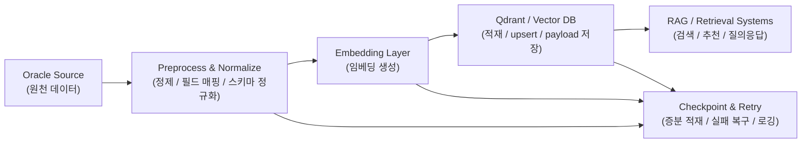

# Oracle → Embedding → Vector DB Pipeline

> **Confidentiality Note**  
> 본 문서는 회사 보안 정책을 준수하는 범위에서, 공개 가능한 설계 의사결정과 비교 실험 결과만 정리한 포트폴리오용 케이스 스터디입니다.

---

## 1. Project Overview

이 프로젝트는 Oracle 기반 원천 데이터를 벡터 검색에 바로 활용할 수 있도록  
**전처리 → 임베딩 → Vector DB 적재**로 이어지는 파이프라인을 설계·구현한 작업입니다.

RAG나 추천 시스템의 품질은 검색 단계에서 결정되는 경우가 많지만, 실제 서비스에서는 검색 이전 단계인 **데이터 정규화와 적재 안정성**이 먼저 확보되어야 합니다.  
그래서 이 프로젝트의 초점은 단순 배치 작업이 아니라, **운영 가능한 적재 파이프라인**을 만드는 데 있었습니다.

---

## 2. Why It Was Hard

### 2.1. 원천 데이터와 검색 데이터의 구조가 다릅니다
Oracle 기반 업무 데이터는 트랜잭션·업무 처리 관점으로 설계되어 있기 때문에,  
벡터 검색이나 하이브리드 검색에 바로 적합한 형태와는 다를 때가 많습니다.

따라서 다음이 필요했습니다.

- 검색에 필요한 필드만 안정적으로 추출
- payload schema를 일관되게 정규화
- 동일 문서 / 동일 개체가 중복 적재되지 않도록 관리

### 2.2. 실험용이 아니라 운영용 파이프라인이 필요했습니다
한 번만 적재하고 끝나는 것이 아니라, 실제 환경에서는 아래 요구가 생깁니다.

- 증분 적재
- 마지막 처리 지점(checkpoint) 관리
- 중간 실패 시 복구
- 임베딩 배치 성능과 적재 안정성 균형

즉, 이 프로젝트는 “Oracle에서 Qdrant에 넣어봤다”보다  
**끊겨도 다시 이어서 적재할 수 있는 구조를 만든 것**이 핵심이었습니다.

---

## 3. Key Design Decisions

## 3.1. Pipeline 단계를 명확히 분리
파이프라인을 다음 단계로 분리했습니다.

1. Source fetch (Oracle)
2. Preprocess / normalize
3. Embed
4. Upsert to Vector DB
5. Checkpoint / retry / logging

이렇게 해야 특정 단계에서 실패했을 때 원인을 분리해서 볼 수 있고, 전체 파이프라인을 다시 처음부터 돌리지 않아도 됩니다.

## 3.2. 증분 적재와 체크포인트를 기본 전제로 설계
운영 환경에서는 전체 재적재보다 **증분 적재**가 더 중요합니다.  
그래서 마지막 처리 지점을 저장하고, 필요 시 해당 지점부터 다시 이어서 적재할 수 있도록 체크포인트 개념을 두었습니다.

## 3.3. 임베딩 모델 선택도 실험 기반으로 결정
임베딩은 품질만으로 결정하지 않고, 실제 운영에서 중요한 다음 요소를 함께 봤습니다.

- 처리 속도
- 다국어 적합성
- 검색 문서의 특성
- 운영 안정성

이를 위해 `multilingual-e5-large` 와 `bge-m3`를 같은 환경에서 비교했습니다.

---

## 4. Architecture

---

## 5. What I Built

- Oracle 기반 원천 데이터 추출 및 전처리 구조 설계
- 검색용 payload schema 정규화
- 임베딩 생성 및 배치 처리 흐름 구성
- Qdrant 적재 / upsert 파이프라인 구현
- 증분 적재와 체크포인트 관리 구조 설계
- 임베딩 모델 비교 평가 및 운영 관점의 선택 기준 정리

---

## 6. Publicly Shareable Evidence

### 6.1. 임베딩 모델 비교 평가
동일한 데이터셋과 하드웨어 환경에서 `multilingual-e5-large`와 `bge-m3`를 비교했습니다.

| 항목 | multilingual-e5-large | bge-m3 |
|---|---:|---:|
| 전체 처리 시간 | 약 24.4분 | 약 28.9분 |
| Total wall time | 1450.73s | 1734.72s |
| Embedding time | 1301.44s | 1588.53s |
| 처리량 | 76.8 docs/s | 63.0 docs/s |

### 6.2. 해석
- `multilingual-e5-large`는 속도와 다국어 운영 적합성 측면에서 유리했습니다.
- `bge-m3`는 구조 특성상 기술 상세 문서 처리에서 장점이 있었지만, 기본 운영값으로는 e5-large가 더 실용적이었습니다.

---

## 7. Outcome

이 프로젝트를 통해 검색 시스템의 기반이 되는 적재 계층을 다음과 같이 정리할 수 있었습니다.

- Oracle 업무 데이터를 검색 친화적인 구조로 전환
- 임베딩 생성과 Vector DB 적재 흐름 표준화
- 증분 적재와 체크포인트를 통한 운영 안정성 확보
- 임베딩 모델 선택을 실험 기반으로 정리

즉, 검색 품질을 높이기 위한 “앞단 인프라”를 안정적으로 만든 작업이었습니다.

---

## 8. Lessons Learned

1. **검색 품질은 검색 로직 이전에 데이터 정규화에서 많이 결정된다.**
2. **운영형 파이프라인은 전체 재실행보다 증분 적재 / 복구성이 중요하다.**
3. **임베딩 모델 선택은 품질뿐 아니라 처리량과 운영 비용을 함께 봐야 한다.**

---

## 9. Tech Stack

- **Language**: Python
- **Source / Storage**: Oracle, Qdrant
- **Embedding**: multilingual-e5-large, bge-m3
- **Infra**: Docker, Linux
- **Ops**: checkpoint, retry, logging, incremental ingestion
