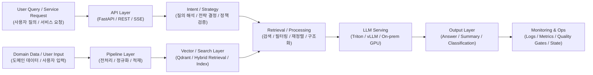

# Architecture

이 문서는 포트폴리오에 포함된 주요 시스템을 **공통 설계 패턴** 기준으로 요약합니다.  
각 프로젝트의 상세 구현은 다르지만, 전반적으로 다음 네 가지 축이 반복됩니다.

1. **Intent / Strategy**
2. **Retrieval / Processing**
3. **Serving / API**
4. **Operations / Observability**

---

## 1. 전체 구조 요약

---

## 2. 프로젝트별 핵심 구조

## 2.1 NTIS AI 챗봇
- Retrieval-first 설계
- SEARCH / LOOKUP / JOIN 전략 분리
- Planner–Contract–Executor 구조
- Canonical evidence와 answer generation 분리
- SSE 기반 응답 및 conversation state 관리

→ [상세 보기](../case-studies/ntis-rag-chatbot.md)

## 2.2 모두의 R&D 질의의도 분석
- 자유 형식 사용자 의견 입력
- 교정 → 구조화 요약 → 주제 분류의 다단계 파이프라인
- 온프레미스 Triton 서빙 + API 연계
- 결과를 서비스에 바로 연결 가능한 정형 출력으로 설계

→ [상세 보기](../case-studies/everyones-rnd-intent-classification.md)

## 2.3 Oracle → Embedding → Qdrant Pipeline
- Oracle 소스 → 전처리 → 임베딩 → 벡터DB 적재
- 체크포인트, 재시도, 증분 적재
- 임베딩 모델 비교와 운영 적합성 평가

→ [상세 보기](../case-studies/oracle-to-qdrant-pipeline.md)

## 2.4 Scholarly OA AI Summarization
- 대규모 논문 데이터 기반 요약 기능
- GPU 추론 환경 구성
- FastAPI API와 플랫폼 연동
- 결과 저장 / 요청 제어 / 운영 로그 처리

→ [상세 보기](../case-studies/scholarly-ai-summarization.md)

---

## 3. 공통 설계 원칙

### Retrieval / Processing First
답변 품질을 높이기 위해서는 생성 이전에 **검색 / 정규화 / 구조화**가 먼저 안정되어야 한다고 봅니다.

### Structured Output over Free-form Output
실무 서비스에서는 "자연스럽게 보이는 응답"보다 **형식이 안정적인 결과물**이 더 중요할 때가 많습니다.

### Contract-driven Design
모드, 입력, 출력, 정책을 중간 레이어에서 임의로 바꾸지 않도록 **계약 중심 설계**를 선호합니다.

### Operability Matters
실제 서비스에서는 모델 성능만큼이나 **로그, 메트릭, 재시작 가능성, 장애 분석 가능성**이 중요합니다.

---

## 4. 문서 가이드

- Benchmarks → [docs/benchmarks.md](./benchmarks.md)
- Contracts → [docs/contracts.md](./contracts.md)
- Operations → [docs/runbook.md](./runbook.md)
