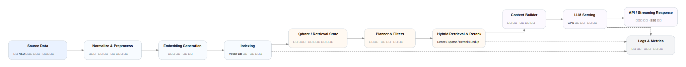

# NTIS Project — Data Ingest / Retrieval / Serving Overview

## 1. Why this document exists

이 문서는 NTIS 프로젝트의 전체 구조를 **데이터 적재 → 검색 → 서빙** 관점에서 요약한 공개용 정제본입니다.
세부 스키마명, 내부 경로, 실제 운영 주소는 제거하고 역할 중심으로 재구성했습니다.

---

## 2. End-to-End Flow

### A. Data Ingest
- 구조화된 국가 R&D 원천 데이터 수집
- 도메인별 정규화 및 전처리
- 메타데이터 정리 및 검색 친화적 필드 구성
- 임베딩 생성 및 벡터 인덱스 적재
- 증분 적재 / 재적재 / 체크포인트 관리

### B. Retrieval
- 사용자 질의 분석 및 scope 판별
- Strategy Planner가 SEARCH / LOOKUP / JOIN 중 하나를 선택
- 질의 유형에 따라 하이브리드 retrieval 수행
  - lexical / sparse / dense 조합
  - server-side filtering
  - rerank / dedup
- 필요 시 관계형 hop 또는 promotion 수행

### C. Serving
- Retrieval 결과를 기반으로 answer context 구성
- LLM serving 계층에서 응답 생성
- streaming response 및 근거 정보 반환
- 로그 / 메트릭 / 상태 저장

---

## 3. Components (Sanitized)

### Ingest Layer
- Source Loader
- Normalizer / Preprocessor
- Embedding Generator
- Vector Index Loader
- Incremental Sync Controller

### Retrieval Layer
- Intent / Scope Analyzer
- Strategy Planner
- Contract Validator
- Hybrid Retriever
- Reranker / Result Filter
- Context Builder

### Serving Layer
- API Gateway
- Session / State Store
- LLM Serving Engine
- Streaming Response Handler
- Logs / Metrics Collector

---

## 4. Design Principles

- **정합성 우선**: 도메인 의미를 고정하지 않으면 검색 품질 개선이 누적되지 않음
- **전략 분리**: SEARCH / LOOKUP / JOIN은 서로 다른 품질 요구를 가짐
- **재현성 확보**: Planner가 내린 전략을 실행 레이어가 재결정하지 않음
- **운영성 확보**: 결과 품질 게이트, 토큰 예산, 상태 저장을 구조에 포함

---

## 5. Related Diagram

