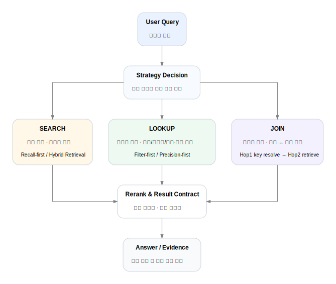

# NTIS Project — Search Strategy Summary

## SEARCH
- 목적: 탐색형 질문에서 누락을 줄이는 것
- 방식: 넓은 후보 수집 + rerank
- 특징: recall-first, 강한 must narrowing 지양

## LOOKUP
- 목적: 상세조회, 식별자성 질문, 사람/기관 조회의 정확도 확보
- 방식: exact seed / structured filter / nested filter
- 특징: precision-first, broad search 우회 금지

## JOIN
- 목적: 과제와 성과처럼 관계형 질의 처리
- 방식: hop1에서 연결 키 확보 → hop2에서 후속 검색
- 특징: relation validity, join seed, join key mode 검증 필요

---

## Why this separation mattered

모든 질의를 하나의 retrieval 방식으로 처리하면,
탐색형 질문에서는 누락이 생기고,
정확조회에서는 오염된 후보가 상위에 섞일 수 있습니다.

전략을 분리함으로써
- 탐색형 질의는 coverage를,
- 정확조회는 precision을,
- 관계형 질의는 structured execution을
각각 우선시할 수 있게 되었습니다.

---

## Related Diagram

