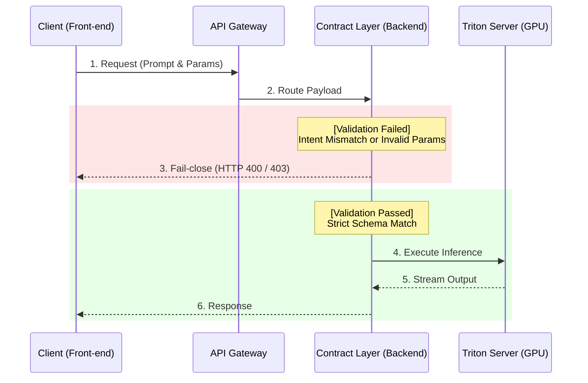

# Troubleshooting & Incident Response

프로덕션 환경에서 대규모 LLM을 서빙하며 발생한 인프라 병목, 보안 취약점, 하드웨어 통신 장애에 대한 트러블슈팅 기록입니다. 
단순한 에러 수정을 넘어, **시스템의 안정성을 보장하는 보수적인 아키텍처 설계**와 **주어진 하드웨어 자원의 효율을 극대화하는 최적화 원칙**을 수립하는 계기가 되었습니다.

---

## 1. 클라이언트 파라미터 조작에 의한 GPU 자원 어뷰징 방어
**"제로 트러스트(Zero-Trust) 기반의 Contract Layer 검증 아키텍처 도입"**

* **Background**: 초기 시스템은 유연성을 위해 프론트엔드(클라이언트)에서 프롬프트 및 일부 추론 파라미터를 동적으로 구성하여 Java 백엔드(Triton 라우팅)로 전달하도록 설계되었습니다.
* **Issue**: 서비스 오픈 직후, 네트워크 페이로드를 임의로 변조하여 서비스 목적과 무관한 프롬프트를 주입하는 취약점이 발견되었습니다. 이로 인해 고비용의 사내 GPU 자원이 무단으로 소모되는 어뷰징 사태가 발생했습니다.
* **Resolution**: API 게이트웨이 레벨의 단순 차단을 넘어, 백엔드 아키텍처를 전면 개편했습니다. 클라이언트의 입력을 절대적으로 신뢰하지 않는 구조를 채택하고, 백엔드에 **'Contract Layer(사전 검증 계층)'**를 신설했습니다. 시스템이 정의한 의도(Intent) 및 허용 규격과 일치하지 않는 요청은 조용히 우회하지 않고 **즉각적으로 요청을 차단(Fail-close)**하도록 조치하여 자원 오남용을 원천적으로 해결했습니다.



---

## 2. 피크 트래픽 시 서빙 타임아웃 해결 및 처리량(Throughput) 극대화
**"추론 엔진 전환 및 Dynamic Batching을 통한 응답 지연 해소"**

* **Background**: A40 GPU 환경에서 Ollama를 활용해 Llama 3 모델을 서빙했으나, 실제 프로덕션 트래픽이 유입되자 기존 아키텍처의 처리량 한계가 드러났습니다.
* **Issue**: 대안으로 Triton Inference Server를 도입했음에도, 동시 요청이 몰리는 피크 시간대에 대기 큐(Queue)가 적체되며 **대규모 타임아웃(Timeout) 및 서비스 지연**이 발생했습니다.
* **Resolution**:
  1. **엔진 고도화**: GPU 연산 효율을 극대화하기 위해 모델을 TensorRT-LLM 엔진 포맷으로 변환(Build)하여 서빙 구조를 고도화했습니다.
  2. **서빙 파라미터 최적화**: Triton의 **Dynamic Batching**을 활성화하여 대기 중인 여러 요청을 하나의 배치로 묶어 처리하도록 구성했습니다. 
  3. **모델 양자화(Quantization)**: VRAM 점유율을 대폭 낮추고 동시 처리 가능한 토큰 수(Batch Capacity)를 증대시켜, 타임아웃 현상을 완벽히 해소하고 피크 타임의 서비스 안정성을 확보했습니다.

---

## 3. 다중 GPU(TP) 환경의 하드웨어 P2P 통신 병목 해결
**"소프트웨어를 넘어선 하드웨어/네트워크(PCIe) 레벨의 병목 디버깅"**

* **Background**: 단일 GPU의 VRAM 및 연산 한계를 극복하기 위해, 2기의 A40 GPU를 묶는 텐서 병렬화(Tensor Parallelism, TP) 아키텍처 구성을 시도했습니다.
* **Issue**: 분산 추론 환경 구성 후, 잦은 통신 에러가 발생하거나 정상 구동 시에도 **단일 GPU보다 오히려 추론 속도가 심각하게 저하**되는 성능 역전 현상을 겪었습니다.
* **Root Cause & Resolution**: 소프트웨어 설정 오류가 아님을 직감하고 NCCL(통신 라이브러리) 로그 및 서버 하드웨어 토폴로지를 분석했습니다. 원인은 서버 메인보드의 **PCIe 보안 기능인 ACS(Access Control Services)가 활성화**되어 있어, GPU 간의 직접 통신(P2P)이 차단되고 모든 데이터가 CPU를 강제로 경유하며 심각한 병목을 유발한 것이었습니다.
* **Outcome**: BIOS 및 Linux OS 레벨에서 ACS 설정을 튜닝(비활성화)하여 GPU 간 직접 통신 채널을 확보했습니다. 이를 통해 통신 오버헤드를 완전히 제거하고 다중 GPU 기반의 거대 모델 서빙 환경을 성공적으로 구축했습니다.

```mermaid
flowchart TD
    subgraph "Before (ACS Enabled - Bottleneck)"
        CPU1[CPU / PCIe Root Complex]
        GPU1a[GPU 0 (A40)]
        GPU1b[GPU 1 (A40)]
        GPU1a -- "Blocked" --x GPU1b
        GPU1a -->|Data| CPU1
        CPU1 -->|Data| GPU1b
        style CPU1 fill:#ffcccc,stroke:#ff0000,stroke-width:2px
    end

    subgraph "After (ACS Disabled - P2P Active)"
        CPU2[CPU / PCIe Root Complex]
        GPU2a[GPU 0 (A40)]
        GPU2b[GPU 1 (A40)]
        GPU2a <-->|P2P Direct Comm| GPU2b
        style GPU2a fill:#ccffcc,stroke:#00cc00
        style GPU2b fill:#ccffcc,stroke:#00cc00
    end
```
