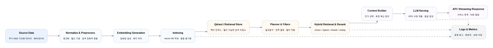

# NTIS RAG System: Contract-based Architecture

검색 오염을 방지하고 데이터의 신뢰성을 보장하기 위해, 엄격한 'Contract(계약)' 검증 기반으로 동작하는 사내 RAG 질의응답 시스템을 설계 및 구축했습니다.

## 1. Background & Challenge: 컨텍스트 길이 병목과 할루시네이션 제어
[LLM 서빙 및 인프라 최적화](../infrastructure/llm-serving-optimization.md) 지표에서 확인된 바와 같이, 검색된 대량의 문서를 LLM 컨텍스트로 일괄 주입할 경우 심각한 응답 지연(TTFT)과 할루시네이션(Hallucination) 리스크가 동반됩니다. 이를 해결하기 위해 시스템의 ** 설명 가능성(Explainability) **을 확보하고, 비정상 요청 시 ** 안전하게 차단(Fail-close) **하도록 아키텍처를 재설계해야 했습니다.

## 2. System Architecture: Planner-Contract-Executor Pattern
LLM을 단순한 텍스트 생성기가 아닌, 전체 워크플로우의 실행 전략을 수립하는 **라우터(Router)**로 활용합니다.

1. **Intent Planner (의도 분석):** 사용자의 질의를 분석하여 `SEARCH`, `LOOKUP`, `JOIN` 세 가지 검색 모드 중 최적의 전략을 결정합니다.
2. **Contract Layer (계약 검증):** Planner가 도출한 파라미터의 정합성을 시스템 엣지에서 검사합니다.
   * *Troubleshooting Point:* "특정 연구자의 과제를 찾아줘"라는 질의에 필수 엔티티(이름)가 누락된 경우, 시스템은 불완전한 검색을 강행하지 않고(Silent Rewrite 우회 방지) 명시적으로 예외를 반환하여 데이터 오염을 차단합니다.
3. **Execution & Generation (실행 및 생성):** Contract Layer를 통과하여 철저히 검증된 데이터(Payload)만을 제한된 컨텍스트로 구성하여 최종 답변을 생성합니다.

## 3. Retrieval Strategy: 검색 모드 분리를 통한 리소스 최적화
모든 질의에 획일적인 벡터 검색(Vector Search)을 수행하는 비효율을 제거했습니다.

* **SEARCH (Recall 지향):** "해안 관련 과제 목록" 등 폭넓은 주제 탐색이 필요할 때 Vector Similarity 기반의 하이브리드 검색을 수행합니다.
* **LOOKUP (Precision 지향):** "특정인이 참여한 과제" 등 명확한 조건이 주어졌을 때, Qdrant의 메타데이터 필터링(Must, Should)을 활용하여 100%의 정확도를 보장합니다.
* **JOIN (Relational 지향):** 과제와 성과 등 데이터 간 복합적인 관계망 추적이 필요할 때 사용합니다.

## 4. Outcomes
* **정형 데이터(Structured Output) 기반 서비스 연동:** LLM의 최종 출력을 단순한 자연어 텍스트가 아닌 JSON 포맷의 메타데이터로 구조화하여, 프론트엔드 및 타 비즈니스 로직에서 즉시 파싱하고 연동할 수 있도록 구현했습니다.
* **응답 지연(TTFT) 최적화:** 질의 의도와 무관한 문서의 무분별한 컨텍스트 주입을 원천 차단하여 토큰 낭비를 방지하고, LLM 서빙 단계의 응답 속도를 효과적으로 통제했습니다.
